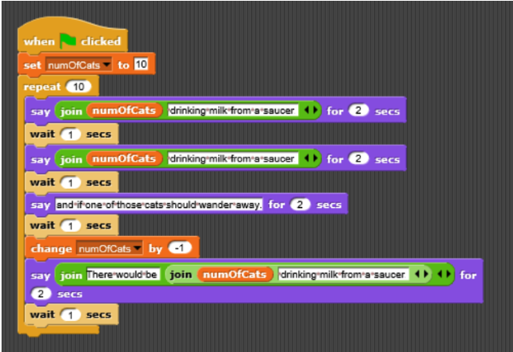

# 4.01-looping-basics

## Remove the Vowels

create a function called `de-vowel()` which will take a string as input and **return** a copy of that string witl all the vowels removed. A string with no vowels should be returned without any changes.

1. Create the function contract for `de_vowel()`
2. Write `de_vowel()` using a `for loop`
3. Write some tests: using a few different examples, call your function to see if it works as expected:
     * what if the string is all vowels?
     * what if there are no vowels?
     * what if there is a mix of vowels and non-vowels and spaces?
  
*hint*: your function will need initialize and return a **new** string variable

### Example

example of the file:
```python
# contract goes here
def de_vowel(strng):
  # your code goes here

no_vowels = de_vowel("This sentence has no vowels")
print(no_vowels)
# other examples go here
```
example of output
```python
>>> python3 de_vowel_lab.py
Ths sntnc ha n vwls
```

### Bonus!
Use a counter (a variable you define outside of a loop to keep track of a values inside a loop) to create a function called `count_vowels()`.
`count_vowels()` takes in a string and returns an int representing the number of vowels in the string.

## Snap! challenge -- 10 Cats Drinking Milk from a Saucer
create the following program in Python:



